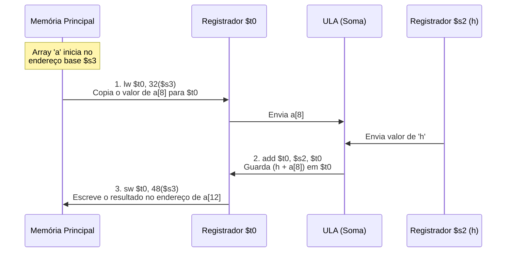

```mermaid
sequenceDiagram
    participant Memoria as Memória Principal
    participant T0 as Registrador $t0
    participant ULA as ULA (Soma)
    participant S2 as Registrador $s2 (h)
    
    Note over Memoria: Array 'a' inicia no<br/>endereço base $s3
    
    %% Passo 1: lw $t0, 32($s3)
    Memoria->>T0: 1. lw $t0, 32($s3)<br/>Copia o valor de a[8] para $t0
    
    %% Passo 2: add $t0, $s2, $t0
    T0->>ULA: Envia a[8]
    S2->>ULA: Envia valor de 'h'
    ULA->>T0: 2. add $t0, $s2, $t0<br/>Guarda (h + a[8]) em $t0
    
    %% Passo 3: sw $t0, 48($s3)
    T0->>Memoria: 3. sw $t0, 48($s3)<br/>Escreve o resultado no endereço de a[12]
```